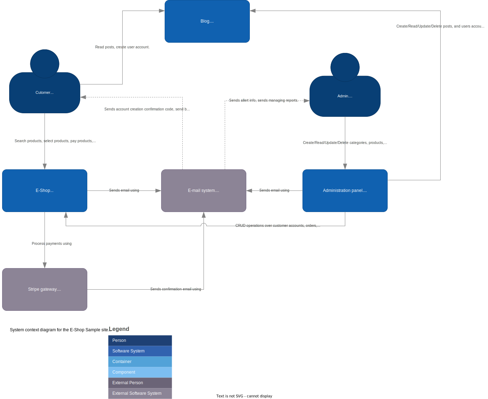
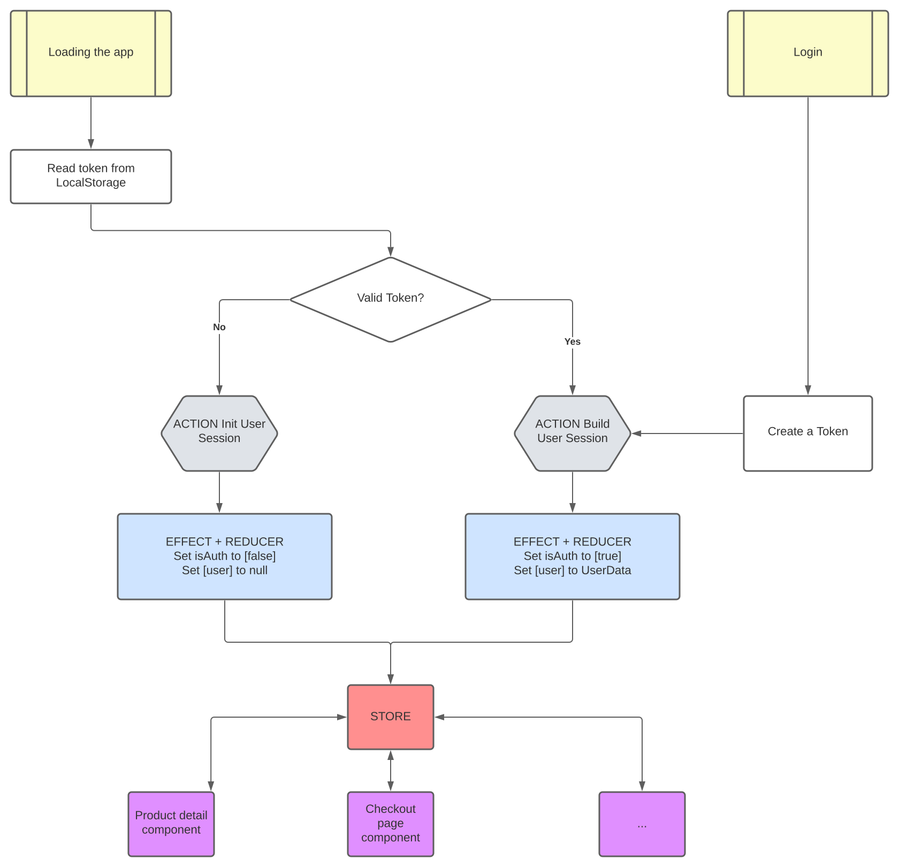

# **`MEAN Fullstack E-Shop`**

This is the Monorepo for the MEAN E-Shop application. This Monorepo has been divided with Git 
submodules, so if you want to fetch the whole project you need to configure or tell Git to fetch
submodules.

The backend also uses Git LFS for the Sample images, so make sure you have installed Git LFS for 
you to fetch the images.

Technologies used:

# **General Overview**

The general architecture is described using the C4 Model:

## **System diagram**

## **Containers diagram**

## **Further**

For information about the components and it's architecture watch the frontend repository,
for info about the API and the protected URL paths see the backend repository.

# **Authentication**

This project uses JWT Token authentication, the authentication method is described as follows:

# **Important**

The backend module expects to find a _.env_ file in this directory, so write your environment
variables here.

> _Example .env file_
>
> API_URL=your/base/api/url
>
> DB_NAME=YOUR_DB_NAME
>
> DB_USER=DB_SAMPLE_USER
>
> DB_PWD=DB_SAMPLE_PASSWORD
>
> JWT_SECRET=yourSecret

The instructions for deploying the backend and frontend are in the corresponding submodules.